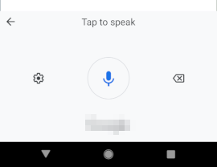

# Offline Android Speech Recognition

> Use a spare Android device to provide an offline speech recognition interface.

## Status
*Proof of Concept.* Right now this software works great for my own personal use, but in order to be more broadly useful it requires testing on a wider range of Android devices.

Please [open a Pull Request][new-pr] with the results of your own tests, or, better, patches that add support for additional devices.

## Dependencies

### Physical
1. A Google Android device ("phone").
2. A computer on your local network to which the phone may be connected by USB ("server").

### Digital
Older versions of any of the following may work, but have not been tested.

#### Phone
1. Termux >= 0.118.0.
2. Node.js >= 17.7.2.
3. npm package manager >= 8.5.2.
#### Computer
1. GNU Bash >= 5.1.4.
2. `adb` >= 1.0.41.
3. Node.js >= 18.12.1. *Versions older than 4.0.0 will **definitely** not work.*

## Overview
### Background
I'd like to have general purpose speech recognition software of decent quality. I like Google's speech recognition software, but don't want my voice leaked to their servers (or anywhere on the internet). I'd also like to not have to pay any money for this.

My Google Pixel 1 phone comes with a feature on its default virtual keyboard for performing text transcription using speech recognition. When an internet connection is detected, the phone will prefer to send my voice to Google's servers for text transcription. However, when the phone is offline, its built-in software is used for entirely local, offline speech recognition and text transcription. It would be very useful to have some means of accessing this for my own purposes. This would let me give an old device a new use, too!

### Problems
None of this functionality is exposed for programmatic control. The problems are these:

1. Recognition can only be initialized by manually tapping the microphone icon on the built-in virtual keyboard.
2. The text transcription will be written out to whatever text field happens to be focused.
3. These must both be done without giving the phone internet access.

### Solution
The first problem is solved by simulating the required user input, by connecting the phone to a **computer** and using `adb`, which has a sub-command for simulating a tap event at a particular X/Y coordinate: `adb shell input tap X Y`.

The second problem requires capturing the text written by the speech recognition virtual keyboard. This is done by giving focus to a `textarea` HTML `input` element, for the keyboard to write into, and whose text input can be detected by its `oninput` Javascript event. This HTML element is part of a **text capture web page** which is served by a Node.js **web server** running on the Android phone itself, using the free software Termux. This local web server also runs a **WebSocket server**. The computer can then run a small **control server** that connects to the WebSocket server, and both receive the text transcriptions captured, and instruct the phone to listen for voice input.

Any computer on the network may then issue a request to the control server over TCP, which will trigger the necessary simulated screen taps to make the phone's start listening for speech, and then transmit back to the control server the text transcription captured, which is then passed on to the requester.

## Installation
### Phone
1. Install Termux. This is freely available without using the Google Play store, on [F-Droid][f-droid].
2. Install Node.js using the command `pkg install nodejs`, run within a Termux terminal.
3. Clone this repository using Termux: `git clone https://github.com/hackergrrl/offline-android-speech-recognition`
4. Put the phone into Airplane Mode or otherwise disable Wi-Fi.
5. Run the web server using Termux: `cd offline-android-speech-recognition; npm install; node server.js`
6. Open a web browser and navigate it to `http://localhost:9001`. *The background will turn blue to indicate a positive connection to the web server. Red indicates something is amiss.*
7. Tap on the text field to focus it and bring up the virtual keyboard.
8. Tap on the little microphone icon, .
9. This will change the keyboard to a UI component with a large microphone icon: .
10. The phone setup is now complete.

### Computer
1. Install the `adb` command as part of the [Android Platform SDK Tools](https://developer.android.com/tools/releases/platform-tools), and ensure it is in your shell's `$PATH`.
2. Install [Node.js](https://nodejs.org/en). *Versions older than 4.0.0 will **definitely** not work.*
3. Install [npm](https://npmjs.org).
4. Clone this repository: `git clone https://github.com/hackergrrl/offline-android-speech-recognition`
5. Install dependencies: `cd offline-android-speech-recognition ; npm install`
6. Plug in the phone to the computer using a USB cable.
7. Run `node control.js`, which will connect to the phone's WebSocket server.
8. Test the interface by running a command on your own computer like `netcat 192.168.1.103 9003`, to connect to the control server. Type `listen` and press enter. The phone's background will change from blue to green, indicating it is listening for voice input. The transcribed result (or an error) is written back.

## API
The control server exposes API access via a TCP server on port 9003. It accepts one command, terminated by a newline: `listen`. This cues the phone to listen for speech in the room or area. After the speech ends, the API will write back the text transcript in lower case. If no speech is heard before the recognition times out (~5 seconds), the text `nevermind` is returned. If there is an error, the text returned will be `ERROR: <text>`.

## Device Compatibility
|Device|Android Version|Works|Notes|
|---|---|---|---|
|Google Pixel 1|10|✅||

## Notes
This has been working very well for me. I use the programmatic interface for voice dictation on my laptop (piped into `xdotool type` for input simulation), as well as for command recognition for various home automation tasks, such as timers and media playback control. I combined this with [vosk](https://alphacephei.com/vosk/), which has offline continuous speech recognition of lesser quality, having vosk do wake-word detection (e.g. "computer!") and then activating the Android phone for command recognition.

## License

[Copyright (c) 2023 Kira Oakley](LICENSE)

[f-droid]: https://f-droid.org
[new-pr]: https://github.com/hackergrrl/offline-android-speech-recognition/pulls
